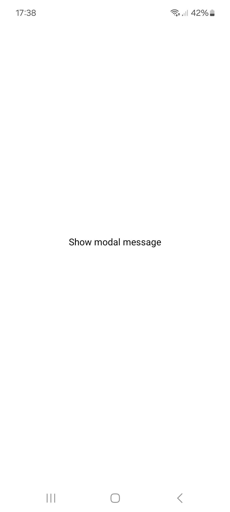
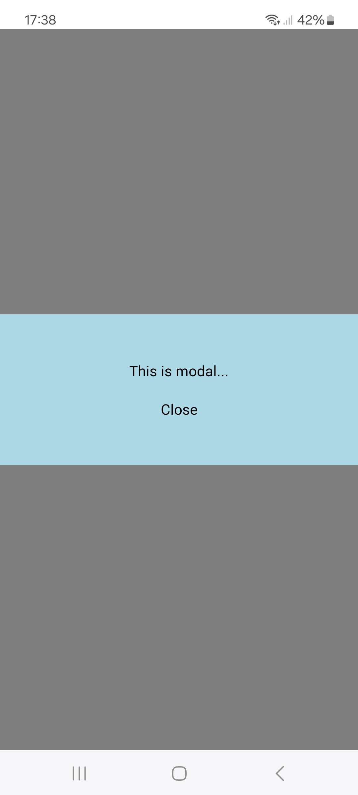

# Modal

Create a new Expo project displaying a screen which contains  Show modal message as Pressable component. 
If user presses the text, a modal screen opens with following content. User can close the modal by pressing Close, or on Android by using hardware back button. 

## Screenshots

