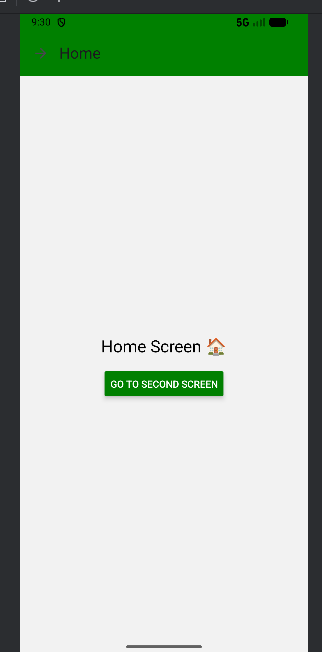
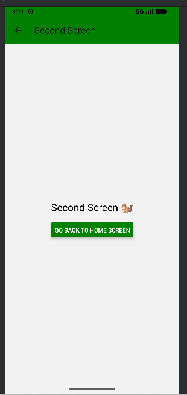

# Material Design and Navigation

In this assignment we created a React Native app with two screens. The goal was to use stack navigation to move between the Home Screen and the Second Screen. The default header was replaced with a custom Application Bar using React Native Paper. The Application Bar shows an arrow‑right icon on the Home Screen (to go forward) and a back arrow on the Second Screen (to go back). Users can navigate from Home Screen to Second Screen.

## Screenshots

### Home Screen

### Second Screen

